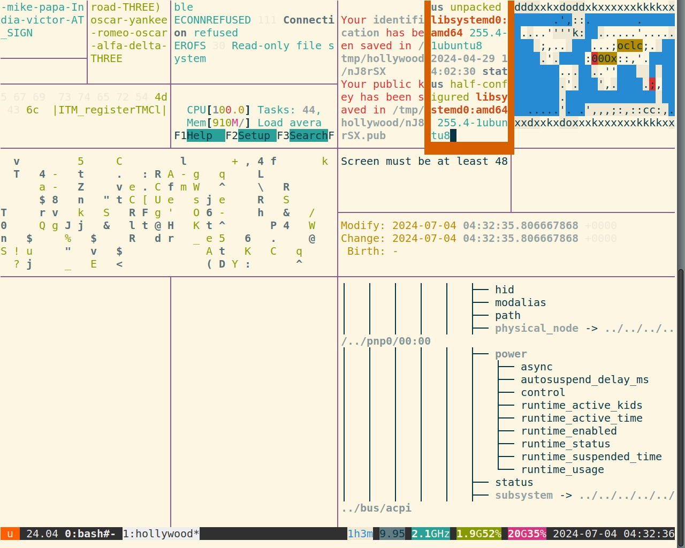

# Home

The Monaco Heist: A Terminal Text Adventure.

Alright, here's a description of the "Monaco Heist" wargame, tailored for your students, emphasizing the learning objectives and the engaging storyline:

Welcome to the Monaco Heist!

"Imagine you're part of an elite team of covert operatives, Whiplash and Talon, tasked with a high-stakes mission in the glamorous setting of Monaco. Your target: Carter Verona, a wealthy car dealership owner suspected of illicit activities. Your objective: infiltrate his heavily secured estate and retrieve a Lamborghini Aventador containing crucial intelligence.

This isn't just a car theft; it's a test of your Linux skills and problem-solving abilities. You'll be navigating a virtual environment, using real-world Linux commands to uncover hidden information, analyze security logs, and ultimately, gain access to the target vehicle.

Here's what you'll learn:

    Essential Linux Commands: You'll master fundamental commands for navigating the file system, searching for data, and analyzing text.
    Data Extraction and Analysis: You'll learn how to extract specific information from log files, configuration files, and even encoded data.
    Security Concepts: You'll get a taste of basic security principles, like understanding file permissions, network analysis, and data encryption.
    Problem-Solving: Each level presents a unique challenge, requiring you to think critically and apply your knowledge to find the solution.
    Real-World Scenarios: The wargame simulates real-world scenarios that system administrators and security professionals encounter daily.

How it works:

    You'll connect to a remote Linux server via SSH, just like connecting to a real system.
    Each level represents a stage of the heist, with a specific objective to complete.
    You'll use read-only Linux commands to analyze data and find the password to the next level's user account.
    Progress through the levels by extracting the correct passwords hidden within the files.
    The final level will require you to signal for extraction, completing the heist.

Remember:

    This is a safe and controlled environment for you to practice your skills.
    Focus on understanding the commands and how they work.
    Don't be afraid to experiment and try different approaches.
    Use the man pages! man [command] is your friend.

Get ready to put your Linux skills to the test and become a master of the Monaco Heist! Good luck, operatives!"
